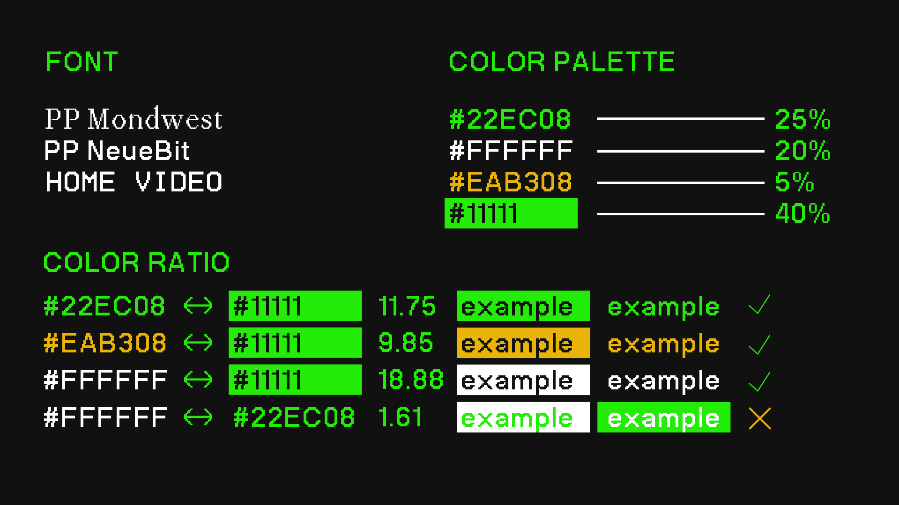
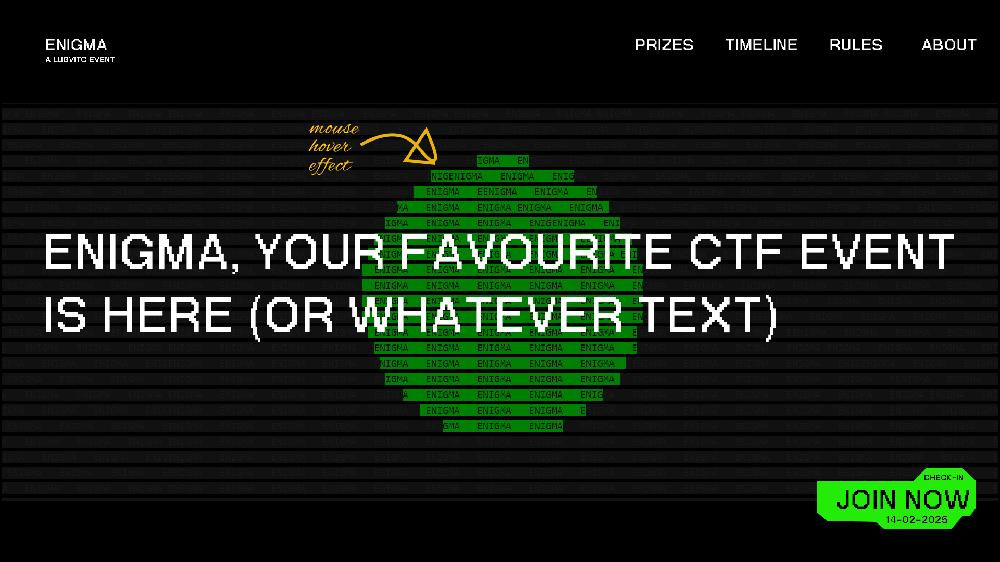
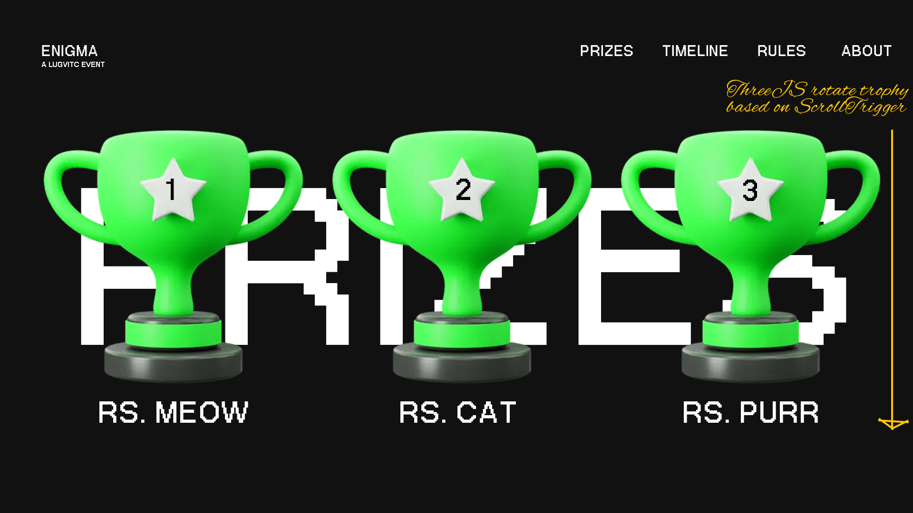
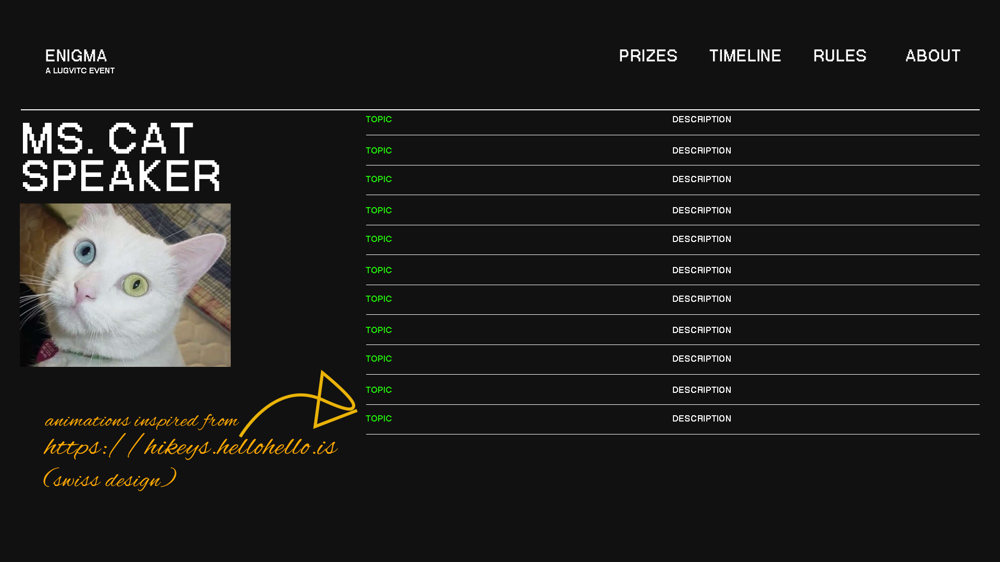
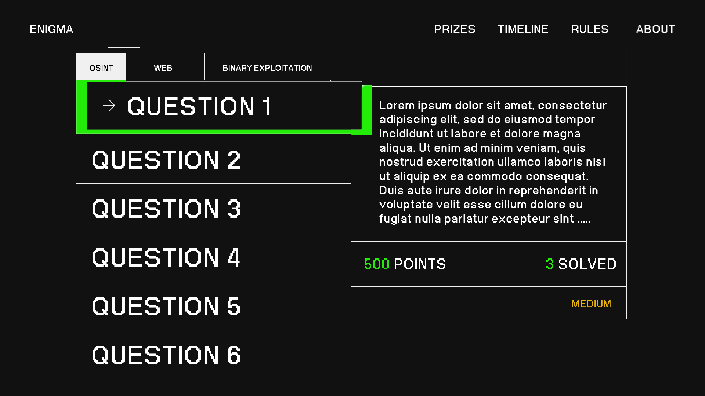
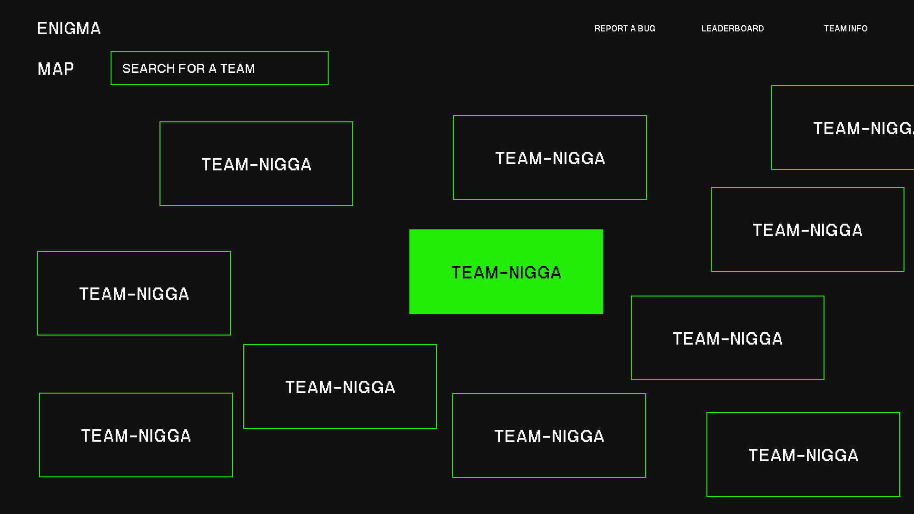
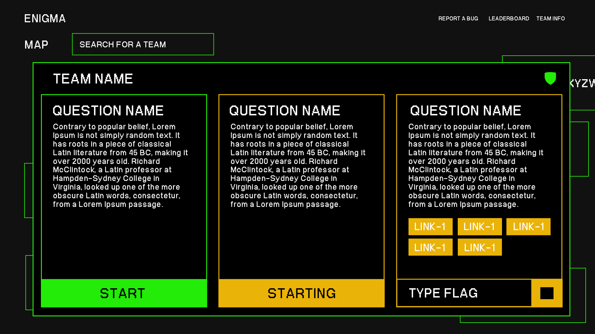

## Theme

## Hero Component
The background is a procedurally generated and is availiable in this repo. The component is responsive and can be used in both desktop and mobile view.

## Prizes Component
This component requires GSAP Scrolltrigger and ThreeJS to work. When the user scrolls in, the first trophy rotates and the text fades in. Then from behind the 1st trophy, the second trophy goes to the left. Then, the third trophy behind the first trophy goes to the right. This first happens for the first trophy and then the second trophy and then the third trophy.

## Marketing / Content Component
This component requires Horizantal scrollable content component, including the images and text. It should also include a text masking effect. The text should be masked by the image and should be revealed as the user scrolls.

## Speaker Component
This component is inspired from https://hikeys.hellohello.is/
Check it out for the animations and the interactions.

## CTFs list
Make this page for the list of CTFs. It should contain around 5 categories, which will be listed later.
This is inspired from https://wondermake.xyz/work

## Challenge Page
Self explainable

## Leaderboard Page
Leaderboard should contain the top 3 players in huge divs, and the rest of the players in a list. The top 3 players should have a different design than the rest of the players. Every time there's an update in the leaderboard, the boxes should be animated by moving up and down. (Optional: There should be a smooth transition from the 1st, 2nd, 3rd to the rest. For example, Whenever an user goes from 4th to 3rd, the 3rd player should move to 4th and the 4th player should move to 3rd with a smooth transition)

## Round - 2
The team names must be distributed in a random format in the map. The team names should be clickable and should show the Questions they have. When clicked on the start button, it should convert itself to enigma-yellow(#eab308) show starting until the backend gives the links. When we get the request, the start button turns into an input to type the flag, with a smooth transition to the right and the "STARTING" turns into a Stop icon.

